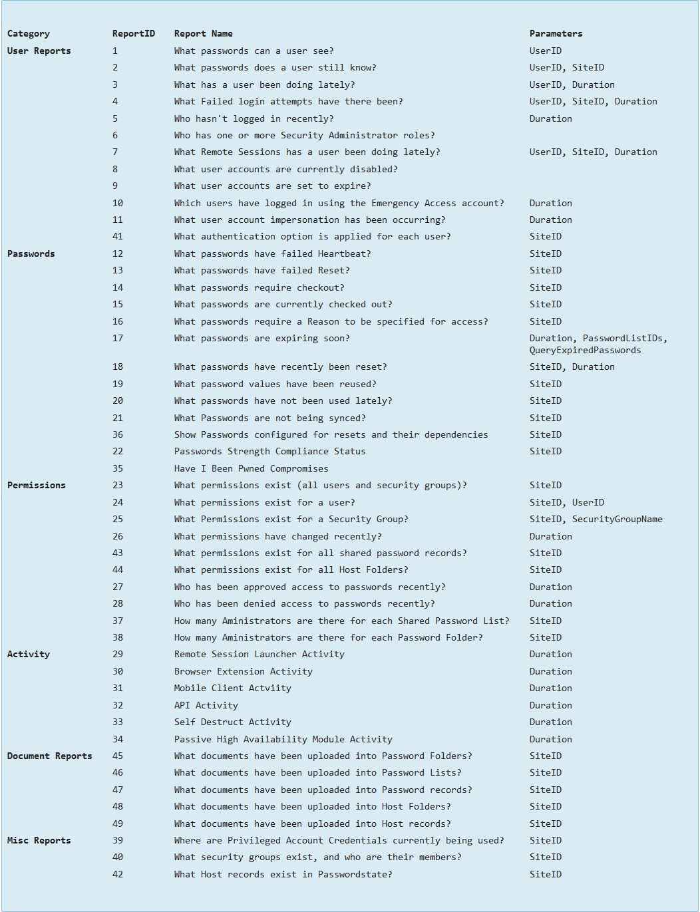

# Invoke-PasswordStateReport

## SYNOPSIS
Run PasswordState reports through the API.

## SYNTAX

### All (Default)
```
Invoke-PasswordStateReport [[-ReportID] <Int32>] [[-SiteID] <Nullable`1[]>] [-ShowReportIDs]
 [-ShowAllReportIDs] [-WhatIf] [-Confirm] [<CommonParameters>]
```

### Specific
```
Invoke-PasswordStateReport [[-ReportID] <Int32>] [[-UserID] <String>] [[-SecurityGroupName] <String>]
 [[-DurationInMonth] <Nullable`1[]>] [[-SiteID] <Nullable`1[]>] [[-PasswordListIDs] <Nullable`1[]>]
 [-QueryExpiredPasswords] [-ShowReportIDs] [-ShowAllReportIDs] [-WhatIf] [-Confirm] [<CommonParameters>]
```

## DESCRIPTION
Run PasswordState reports through the API.  
If your account in PasswordState has been granted the 'Reporting' Security Administrator's role, then all of the reports found on the screen `Administration -> PasswordState Administration -> Reporting` can also be run via the API.

You can use these reports in combination with other functions, f.e. report **23** in combination with the `*Permission` functions to check if a PasswordState object already has the appropriate permissions.  
The following reports with available parameters can be used.  
The listed parameter names under **Parameters** can be used as parameters for this function:



## EXAMPLES

### Example 1
```powershell
PS C:\> Invoke-PasswordStateReport -ShowAllReportIDs
```

Show all reports that can possibly be executed through the api in list view.

### Example 2
```powershell
PS C:\> Invoke-PasswordStateReport -ShowReportIDs
```

Show all reports that can possibly be executed through the api in a table/hashtable view sorted by category.

### Example 3
```powershell
PS C:\> Invoke-PasswordStateReport -ReportID 23
```

Run report with ID 23 (What permissions exist (all users and security groups)?). The response (PSCustomObjects) can be filtered and used for other cmdlets/functions.

### Example 4
```powershell
PS C:\> Invoke-PasswordStateReport -ReportID 24 -UserID "domain\username"
```

Run report with ID 24 (What permissions exist for a user?) and specify a user id for filtering.

## PARAMETERS

### -DurationInMonth
The period in which data can be reported against. Possible values are `0 for current month`, `1 for the past 30 days`, and then `any other integer representing the quantity of months`.

For the '**What passwords are expiring soon?**' report however, Duration refers to the **number of days** you wish to look ahead for passwords which are going to expire.

```yaml
Type: Nullable`1[]
Parameter Sets: Specific
Aliases: Duration

Required: False
Position: 2
Default value: None
Accept pipeline input: True (ByPropertyName)
Accept wildcard characters: False
```

### -PasswordListIDs
This parameter is only used for the '**What passwords are expiring soon?**' report. The value of PasswordListID which can been seen on the screen `Administration -> Passwordstate Administration -> Password Lists`. You can also specify multiple PasswordListID's here by comma separating them.

```yaml
Type: Nullable`1[]
Parameter Sets: Specific
Aliases:

Required: False
Position: 3
Default value: None
Accept pipeline input: True (ByPropertyName)
Accept wildcard characters: False
```

### -QueryExpiredPasswords
Used for the '**What passwords are expiring soon?**' Report to indicate whether you also wish to report on passwords which have already expired, instead of just the passwords which are about to expire.

```yaml
Type: SwitchParameter
Parameter Sets: Specific
Aliases:

Required: False
Position: 4
Default value: None
Accept pipeline input: True (ByPropertyName)
Accept wildcard characters: False
```

### -ReportID
The ID of the Report, as documented above in the screenshot or by applying the parameter `-ShowAllReportIDs` or `ShowReportIDs`.  
Possible values: 1-49.  

```yaml
Type: Int32
Parameter Sets: (All)
Aliases:

Required: False
Position: 0
Default value: None
Accept pipeline input: True (ByPropertyName)
Accept wildcard characters: False
```

### -SecurityGroupName
The name of the Security Groups which can been seen on the screen `Administration -> Passwordstate Administration -> Security Groups`.

```yaml
Type: String
Parameter Sets: Specific
Aliases:

Required: False
Position: 1
Default value: None
Accept pipeline input: True (ByPropertyName)
Accept wildcard characters: False
```

### -ShowAllReportIDs
Show all reports (ID + Name) that can possibly be executed through the api.  
Output in list view.

```yaml
Type: SwitchParameter
Parameter Sets: (All)
Aliases:

Required: False
Position: 3
Default value: None
Accept pipeline input: True (ByPropertyName)
Accept wildcard characters: False
```

### -ShowReportIDs
Show all reports (ID + Name) that can possibly be executed through the api.  
Output in a table/hashtable view sorted by category.

```yaml
Type: SwitchParameter
Parameter Sets: (All)
Aliases:

Required: False
Position: 2
Default value: None
Accept pipeline input: True (ByPropertyName)
Accept wildcard characters: False
```

### -SiteID
If you leave this parameter **blank**, it will report data based on **all** Site Locations. Values are **0** for **Internal**, and all other SiteID's can be found on the screen `Administration -> Remote Site Administration -> Remote Site Locations`.  
SiteID 0 = Default site 'Internal'

```yaml
Type: Nullable`1[]
Parameter Sets: (All)
Aliases:

Required: False
Position: 1
Default value: None
Accept pipeline input: True (ByPropertyName)
Accept wildcard characters: False
```

### -UserID
The value of **UserID** which can been seen on the screen `Administration -> Passwordstate Administration -> User Accounts`.

```yaml
Type: String
Parameter Sets: Specific
Aliases:

Required: False
Position: 0
Default value: None
Accept pipeline input: True (ByPropertyName)
Accept wildcard characters: False
```

### -Confirm
Prompts you for confirmation before running the cmdlet.

```yaml
Type: SwitchParameter
Parameter Sets: (All)
Aliases: cf

Required: False
Position: Named
Default value: None
Accept pipeline input: False
Accept wildcard characters: False
```

### -WhatIf
Shows what would happen if the cmdlet runs.
The cmdlet is not run.

```yaml
Type: SwitchParameter
Parameter Sets: (All)
Aliases: wi

Required: False
Position: Named
Default value: None
Accept pipeline input: False
Accept wildcard characters: False
```

### CommonParameters
This cmdlet supports the common parameters: -Debug, -ErrorAction, -ErrorVariable, -InformationAction, -InformationVariable, -OutVariable, -OutBuffer, -PipelineVariable, -Verbose, -WarningAction, and -WarningVariable. For more information, see [about_CommonParameters](http://go.microsoft.com/fwlink/?LinkID=113216).

## INPUTS

### System.Int32

### System.String

### System.Nullable`1[[System.Int32, System.Private.CoreLib, Version=4.0.0.0, Culture=neutral, PublicKeyToken=7cec85d7bea7798e]][]

### System.Management.Automation.SwitchParameter

## OUTPUTS

### System.Object
## NOTES

## RELATED LINKS
